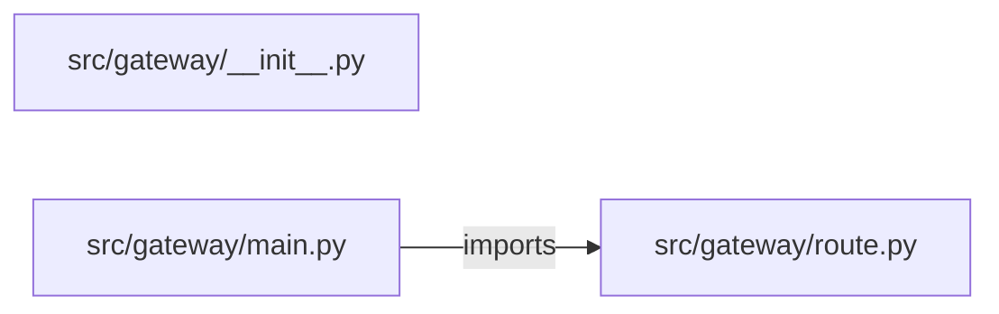

# llm-api-gateway — project architecture

[README](README.md) · [Interview questions and answers](INTERVIEW_QA.md)

## Purpose and scope

Accept only `local-small` and `local-large`. Price the call from the token cap and reject it when the spend would pass 100. The completion is a local stub. No provider is called.

This document describes files and symbols in this checkout. Deployment templates and statements in the original overview are distinguished from a verified running environment.

## Component diagram



For Python repositories, arrows show resolved local imports, not network calls or deployment order. Otherwise the diagram is a repository component map; containment arrows do not assert runtime integration.

## Components and responsibilities

| Component | Responsibility |
| --- | --- |
| [`src/gateway/main.py`](src/gateway/main.py) | HTTP handlers: `POST /complete` |
| [`src/gateway/route.py`](src/gateway/route.py) | Functions: `complete` |
| [`requirements.txt`](requirements.txt) | Implementation or supporting configuration |
| [`src/gateway/__init__.py`](src/gateway/__init__.py) | Implementation or supporting configuration |
| [`tests/test_gateway.py`](tests/test_gateway.py) | Executable checks and regression examples |
| [`.github/workflows/ci.yml`](.github/workflows/ci.yml) | GitHub Actions job definitions |
| [`README.md`](README.md) | Project explanations or operating notes |

## Request interface

| Method and path | Handler | Source |
| --- | --- | --- |
| `POST /complete` | `post_complete` | [`src/gateway/main.py`](src/gateway/main.py#L7) |

The table lists literal route decorators found in the inspected Python modules. Router prefixes and middleware can add behavior; check the linked handler and application setup before calling an endpoint.

## Implementation walkthrough

### `complete(model, prompt, max_tokens, spent)`

Source: [`src/gateway/route.py`](src/gateway/route.py#L4).

Calls visible in this function: `len`, `prompt.split`.

```python
def complete(model, prompt, max_tokens, spent):
    if model not in MODELS:
        return {"allowed": False, "reason": "Model is not on the allowlist.", "called_provider": False}
    cost = MODELS[model] * max_tokens
    if spent + cost > BUDGET:
        return {"allowed": False, "reason": "Token budget exceeded.", "cost": cost, "called_provider": False}
    words = len(prompt.split())
    return {"allowed": True, "completion": f"local-stub:{words} words", "cost": cost, "called_provider": False}
```

## Data and state

- [`src/gateway/route.py`](src/gateway/route.py) defines module-level containers: `MODELS`.

Module-level dictionaries/lists live in a Python process. They can be fixtures or mutable state; inspect writes before treating them as persistent storage. A production extension would need to define persistence and concurrency behavior explicitly.

## Data flow and design decisions

### What is the input-to-output contract of `complete`

In [`src/gateway/route.py`](src/gateway/route.py#L4), `complete(model, prompt, max_tokens, spent)` receives the inputs. The function computes these intermediate values:

- `cost = MODELS[model] * max_tokens`
- `words = len(prompt.split())`

Its result is defined by:

- `{'allowed': True, 'completion': f'local-stub:{words} words', 'cost': cost, 'called_provider': False}`
- `{'allowed': False, 'reason': 'Model is not on the allowlist.', 'called_provider': False}`
- `{'allowed': False, 'reason': 'Token budget exceeded.', 'cost': cost, 'called_provider': False}`

### Which decision rules or boundary conditions should an interviewer challenge

The implementation in [`src/gateway/route.py`](src/gateway/route.py#L4) branches on:

- `model not in MODELS`
- `spent + cost > BUDGET`

A useful extension is a table-driven test that covers each condition just below, at, and above its boundary where applicable. These expressions are the current rules; changing them changes behavior and should be justified by the project’s acceptance criteria.

## Setup and verification

The following commands are derived from the checked-in dependency/test contracts. Execute them from the repository root; the block prepares a local environment, not a cloud deployment.

```bash
python3 -m venv .venv
source .venv/bin/activate
python -m pip install -r requirements.txt
python -m pytest -q
```

Python dependencies: [`requirements.txt`](requirements.txt).

Test entry points: [`tests/test_gateway.py`](tests/test_gateway.py).

Automation definitions: [`.github/workflows/ci.yml`](.github/workflows/ci.yml). Read their triggers and job steps to determine what CI actually runs.

## Operating boundaries and design review

Before turning this checkout into a customer deployment, establish the input contract, data ownership, access controls, failure response, evaluation criteria, and rollback owner. Repository fixtures and unit tests demonstrate local behavior; they do not establish throughput, uptime, compliance, or business impact.

A useful architecture review starts with the linked implementation: identify where input enters, where a decision is made, which state can change, and which external dependency can fail. Add a deployment view only for infrastructure that is actually configured and exercised.
